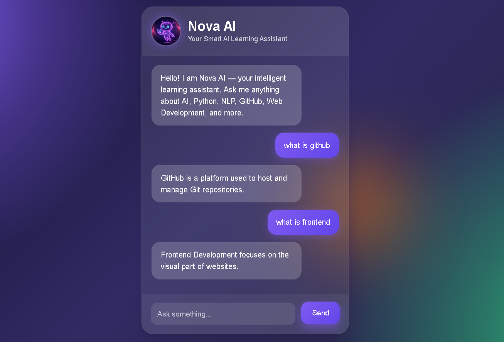

# 🤖 Nova AI FAQ Chatbot

## 📌 Project Overview

Nova AI is an intelligent FAQ chatbot built using Python Flask and NLP techniques.

The chatbot answers questions related to:

* Artificial Intelligence
* Python
* Web Development
* NLP
* GitHub
* Programming

The system uses Natural Language Processing and similarity matching to understand user questions and provide relevant answers.

---

## 🚀 Features

* Modern futuristic UI
* NLP preprocessing
* TF-IDF vectorization
* Cosine similarity matching
* AI typing animation
* Responsive chatbot design
* Enter key support
* Floating glow effects
* Smart FAQ matching

---

## 🛠 Technologies Used

* Python
* Flask
* HTML
* CSS
* JavaScript
* NLTK
* Scikit-learn

---

## 🧠 AI Concepts Used

* Natural Language Processing (NLP)
* Tokenization
* Stopword Removal
* TF-IDF Vectorization
* Cosine Similarity

---

## 📂 Project Structure

Task-2-AI-FAQ-Chatbot/
│
├── app.py
├── faq_data.py
├── requirements.txt
├── README.md
│
├── templates/
│   └── index.html
│
└── static/
├── style.css
└── bot.png

---

## ▶️ How to Run

### Install dependencies

pip install -r requirements.txt

### Run project

python app.py

---

## 📸 Screenshot

---

## 👩‍💻 Author

Varshita

CodeAlpha AI Internship Project
